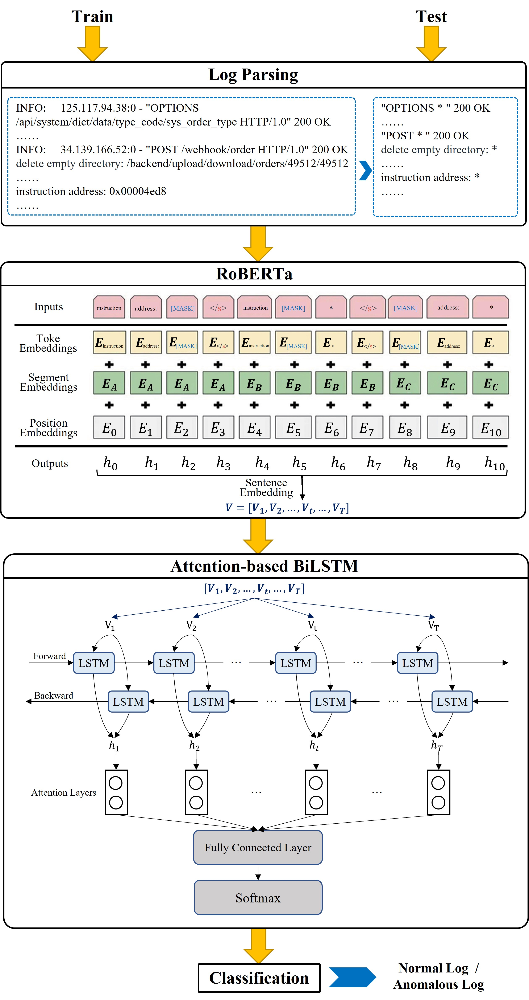

LogRoBERTa: An Innovative Model for Detecting Hidden Anomalies in Long and Complex Log Sequences

This paper introduces an innovative log detection model named LogRoBERTa. Leveraging the RoBERTa model for pre-training, LogRoBERTa captures contextual information from software logs, comprehends complex log structures, and employs Attention-based Bi-LSTM for log anomaly detection.
